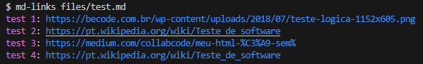

# Markdown Links

## Contents

- [1. Preface](#1-preface)
- [2. Project summary](#2-project-summary)
- [3. Getting started](#3-getting-started)
- [4. Technologies](#4-technologies-used)
- [5. Acceptance criteria](#5-acceptance-criteria)
- [6. Author](#6-author)

---

## 1. Preface

In the ever-evolving landscape of web development and content management, [Markdown](https://pt.wikipedia.org/wiki/Markdown) has emerged as a popular choice for creating structured and easily readable documentation. It's a lightweight markup language that allows writers to focus on content, making it an excellent choice for creating README files, documentation, and other textual content within a project. However, as projects grow, so does the complexity of managing and validating the links contained within Markdown files. That's where md-links comes in.


## 2. Project Summary

Md-links is an Javascript library that simplifies the process of extracting links from Markdown files, validating them, and providing valuable statistics the links. It's designed to be easily installable through npm, making it accessible to developers.

**Key Features:**

- Link Extraction: md-links can efficiently scan Markdown files and extract all the links within them, saving you the hassle of manual extraction.

- Link Validation: It goes a step further by validating these links to ensure they are active.

- Statistics Generation: md-links provides insightful statistics on the links found in the files.

## 3. Getting started

```
npm install
```

To extract links from a Markdown file, run:

```
md-links directoryName/fileName.md
```


To validate links from a Markdown file, run:
```
md-links directoryName/fileName.md --validate
```


To get statistics for links from a Markdown file, run:
```
md-links directoryName/fileName.md --stats
```


To get statistics and validate links from a Markdown file, run:
```
md-links directoryName/fileName.md --stats --validate
```


## 4. Technologies Used

- Node.js/Javascript
- CLI (Command Line Interface)
- File System

## 5. Acceptance criteria

[ X ] Installable via ``` npm ```

[ X ] Executable via Command Line Interface

[ X ] Options for user to validate and get statistics on links from a file

[ X ] User can see wich links are broken

## 6. Author

**Gabriela Faria**
- On github: [@gabrielafaria608](https://github.com/gabrielafaria608)
- On Linkedin: [@gabrielafaria](https://www.linkedin.com/in/gabriela-faria-649503182)
